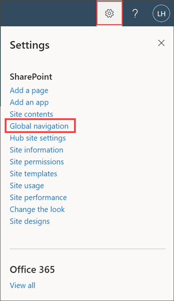
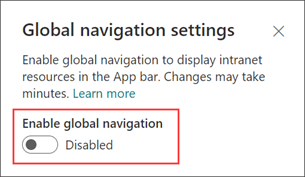
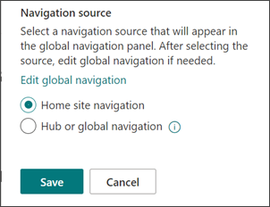
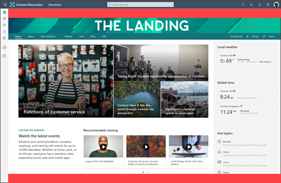

# Introduction to the SharePoint app bar

Help users find important content and resources no matter where they are in SharePoint. The SharePoint app bar improves the global way-finding and creation experiences while dynamically displaying personalized sites, news, files, and lists. The app bar is on the left-hand side anywhere in modern sites.

> [!NOTE]
> Only Viva Connections customers who are using SharePoint home sites need to enable and customize SharePoint global navigation. Learn more about [How Viva Connections and SharePoint home sites work together to create user experiences](viva-connections-overview.md#how-sharepoint-home-sites-and-viva-connections-work-together).

:::image type="content" source="../media/connections/sharepoint-app-bar/app-bar-png.png" lightbox="../media/connections/sharepoint-app-bar/app-bar-png.png" alt-text="Screenshot of the tabs in the SharePoint app bar.":::

## The SharePoint app bar experience

The SharePoint app bar brings together intranet resources and personalized content like sites, news, files, and lists. Enable global navigation to allow users to easily navigate to important intranet resources anywhere in SharePoint. Customize global navigation details and the rest of the content will dynamically display and update personalized content for sites, news, and files. Access your Viva Connections Dashboard, news, or resources. Create sites, files, and lists easily from anywhere in SharePoint.

> [!NOTE]
>
> - The Connections icon will only show to customers who have enabled a Viva Connections experience with a configured and published dashboard.

:::image type="content" source="../media/connections/sharepoint-app-bar/sharepoint-app-bar-overview.png" lightbox="../media/connections/sharepoint-app-bar/sharepoint-app-bar-overview.png" alt-text="Screenshot of the SharePoint app bar tabs.":::

> [!NOTE]
>
> - Global navigation is the only app bar tab that can be customized.
> - If global navigation is disabled or not configured, the home icon links to the SharePoint start page.
> - Specific SharePoint app bar tabs can't be disabled.
> - The SharePoint app bar can't be disabled on specific sites.
> - The SharePoint app bar isn't available on classic SharePoint sites.
> - The SharePoint app bar might affect current page customizations, specifically customizations that appear on the left side.
> - The SharePoint app bar won't display in SharePoint for guests outside of your organization.
> - In GCC High and DoD environments users might experience a degraded experience for the My sites panel in the app bar.
> - Extra restrictions might apply to tenants within the GCC High and DoD environments when using My News in the SharePoint app bar.
> - Global navigation in the SharePoint app bar must be enabled for SharePoint resources to display in the [Microsoft Teams app bar for Viva Connections](viva-connections-overview.md).

The SharePoint app bar is a significant change to the user experience and your organization's [intranet information architecture](/sharepoint/information-architecture-modern-experience). To ensure a seamless experience, Microsoft created specific guidance on how to design current navigation to compliment the global navigation feature. There's also [end-user guidance](https://support.microsoft.com/office/use-the-sharepoint-app-bar-b2ab82d5-9af7-445e-ad24-236c5a86b5f8?ui=en-US&rs=en-US&ad=US) to help onboard the rest of your organization.

## Customize global navigation in the app bar

Global navigation can be enabled and customized in the SharePoint app bar. Customize the global navigation logo, title, and source depending on your users’ and organization’s needs.

If you choose to keep global navigation disabled, the home icon links to the SharePoint start page.

> [!NOTE]
>
> - Site owner permissions (or higher) to the SharePoint home site are required to enable global navigation.
> - Users need read access (or higher) to the SharePoint home site to view the global navigation links.
> - [Audience targeting](https://support.microsoft.com/office/target-content-to-a-specific-audience-on-a-sharepoint-site-68113d1b-be99-4d4c-a61c-73b087f48a81) can be applied to menu links in global navigation.
> - If you get an error after editing links to sites, try deleting the link and adding it again.
> - Implementing global navigation might take up to 24 hours for the changes to take effect for users.

### Get started customizing the global navigation tab

1. Set up a [SharePoint home site](home-site-plan.md) if your organization doesn’t already have one.

2. [Share the SharePoint home site](https://support.microsoft.com/office/share-a-site-958771a8-d041-4eb8-b51c-afea2eae3658) with everyone in your organization to ensure all users can access the global navigation links.

3. Navigate to your organization’s SharePoint home site.

4. Select **Settings** and then select **Global navigation** settings.

    

    >[!NOTE]
    > If you don't see **Global navigation** in the **Settings** pane on the SharePoint home site, you might not have site owner permissions (or higher) to the SharePoint home site.

5. Switch the **Enable global navigation** toggle to **On**.

    

6. Next, add the **Logo** to represent global navigation for your organization (organization or custom logo). No action is needed if you choose to keep the default home icon.

    Global navigation logo specifications:

    - The logo size should be 20x20 pixels
    - PNG file type
    - Transparent background recommended

7. Then, enter a **Title** that's to be displayed at the top of the global navigation pane.

8. Under **Navigation source** make edits to the selected global navigation source if needed by selecting **Edit global navigation**.

9. Select **Save** when you're done. Updates to global navigation might take several minutes before they appear.

    

> [!NOTE]
>
> - The global navigation source can be edited at any time by site owners or admins of the SharePoint home site.
> - The site and global navigation [links and labels](https://support.microsoft.com/office/3cd61ae7-a9ed-4e1e-bf6d-4655f0bf25ca) can be edited at any time by editors of the SharePoint home site.
> - Implementing global navigation might take up to 24 hours for the changes to take effect.
> - If you get an error after editing links to sites, try deleting the link and adding it again.

### Determine the global navigation source depending on your SharePoint home site’s configuration

If you haven’t set up your [SharePoint home site](/sharepoint/home-site), do that first and if you're setting up a SharePoint home site specifically to implement global navigation, review this guidance.

#### For SharePoint home sites that are a hub, you have two source options

:::image type="content" alt-text="Screenshot of the site and hub navigation source options." source="../media/connections/sharepoint-app-bar/app-bar-hub.png":::

- Select the site navigation source to display the SharePoint home site’s navigation.
- Select the Hub or global navigation source to display the SharePoint home site’s hub navigation.

  > [!NOTE]
  > When you apply the extended header layout to the site, you'll no longer see the site navigation.

#### For SharePoint home sites that aren't a hub, you have two source options

:::image type="content" alt-text="Screenshot of the site navigation source option." source="../media/connections/sharepoint-app-bar/app-bar-site.png":::

- Select the site navigation source to display the SharePoint home site navigation.
- Create a secondary set of navigation nodes specifically for the global navigation panel by selecting **Hub or global navigation**. Then, select **Edit global navigation** to create the new global navigation menu. Select **Save** when you're done.

  > [!NOTE]
  > For SharePoint home sites that aren't a [hub site](https://support.microsoft.com/office/fe26ae84-14b7-45b6-a6d1-948b3966427f) and choose to create a secondary set of navigational nodes for the global navigation pane - if you decide to make your SharePoint home site a hub in the future, the new hub site navigation inherits the current navigational nodes for global navigation and can be [edited at any time](https://support.microsoft.com/office/3cd61ae7-a9ed-4e1e-bf6d-4655f0bf25ca).

## See all the different ways you can set up global navigation

Depending on the content you want to make available in the global navigation, you can configure your SharePoint home site navigation and global navigation in three different ways.

### Display the SharePoint home site’s navigation in global navigation

Display hub and site navigation on the SharePoint home page, and the home site navigation in the global navigation panel.

1. Navigate to the SharePoint home site’s **Settings** and then **Global navigation**.

2. **Enable** global navigation, enter a **Title**, and then select **Home site navigation** as the source.

3. Select **Save**. Changes might take a few minutes to reflect.

### Display the SharePoint home site’s hub navigation in global navigation

Display hub and site navigation on the SharePoint home page, and the hub navigation in the global navigation panel.

1. Navigate to the SharePoint home site’s **Settings** and then **Global navigation**.

2. **Enable** global navigation, enter a **Title**, and then select **Hub or global navigation** as the source.

3. Select **Save**. Changes might take a few minutes to reflect.

### Hide the site navigation and display it in the global navigation

Display just the hub navigation on the SharePoint home page, and the site navigation in the global navigation panel.

1. Start by hiding the site navigation by going to **Settings**, then **Change the look**, then **Navigation** and toggle the **Site navigation visibility** to **Off**.

2. Then, navigate to the SharePoint home site’s **Settings** and then **Global navigation**.

3. **Enable** global navigation, enter a **Title**, and then select **Home site navigation** as the source.

4. Select **Save**. Changes might take a few minutes to reflect.

## Set up a SharePoint home site for the first time

A [SharePoint home site](home-site-plan.md) is a SharePoint communication site that you create and set as the top landing page for all users in your intranet. The home site brings together news, events, conversations, and other resources to deliver an engaging experience that reflects your organization's voice, priorities, and brand.

It's recommended that you set up a SharePoint home site for your organization to take full advantage of SharePoint’s communication and collaboration features and is required to enable and customize global navigation in the SharePoint app bar.

### Set up a SharePoint home site just for global navigation

If you're creating a [SharePoint home site](home-site-plan.md) for the main purpose of setting up global navigation, you can simplify the steps recommended to plan and launch a SharePoint home site.

Learn more about planning navigation in SharePoint and apply information architecture principles to your new SharePoint home site’s navigational design.

> [!NOTE]
>
> - Only one communication site can be set as the SharePoint home site.
> - The first time you set up a SharePoint home site, it might take up to several minutes for the changes to take effect.
> - SharePoint admin credentials are required to use the SharePoint Online Management Shell tool that is required to transform a communication site into a SharePoint home site.

1. Start by creating a [SharePoint communication site](https://support.microsoft.com/office/7fb44b20-a72f-4d2c-9173-fc8f59ba50eb).
2. [Customize the communication site navigation](https://support.microsoft.com/office/3cd61ae7-a9ed-4e1e-bf6d-4655f0bf25ca) to reflect the view you’d like to see in the global navigation pane. You can make edits to the navigation source and individual labels and links at any time.
3. [Set this communication](/sharepoint/home-site#set-a-site-as-your-home-site) site as a SharePoint home site using the SharePoint Online Management Shell tool.
4. [Share the SharePoint home site with users](https://support.microsoft.com/office/958771a8-d041-4eb8-b51c-afea2eae3658) so they can access the global navigation links.
5. On the SharePoint home site, select **Settings** and then **Global navigation** to **enable** and customize.
6. For the global navigation source, select **Home site navigation** to display the SharePoint home site navigation that you created in the global navigation panel, then select **Save**.

## Understand how the app bar might affect page customizations

The SharePoint app bar might affect current page customizations, specifically customizations positioned to the left of your page.
For organizations using [page placeholders](/sharepoint/dev/spfx/extensions/get-started/using-page-placeholder-with-extensions), the SharePoint app bar will cover parts of both the header and footer page placeholder. In the following image, the placeholder footprint is in red:

## Modernize classic SharePoint sites to display the SharePoint app bar

The SharePoint app bar only appears in [modern SharePoint sites](/sharepoint/dev/transform/modernize-classic-sites) and [pages](/sharepoint/dev/transform/modernize-userinterface-site-pages).

We highly recommend modernizing classic sites not only to display the SharePoint app bar but for a more consistent user experience. Learn more about how to modernize classic SharePoint sites and  pages using the open-source [SharePoint PnP Page Transformation solution](/sharepoint/dev/transform/modernize-userinterface-site-pages).

## Teach end users about this feature

Help end users understand [how the new SharePoint app bar works](https://support.microsoft.com/office/use-the-sharepoint-app-bar-b2ab82d5-9af7-445e-ad24-236c5a86b5f8?ui=en-US&rs=en-US&ad=US).

### Resources

- Learn more about [SharePoint home sites](home-site-plan.md)
- Learn more about [planning](/sharepoint/planning-hub-sites) and [creating hub sites](/sharepoint/create-hub-site)
- Learn more about [navigation and information architecture in SharePoint](/sharepoint/information-architecture-modern-experience)
- Learn more about [sharing and permissions in SharePoint](/sharepoint/modern-experience-sharing-permissions)
