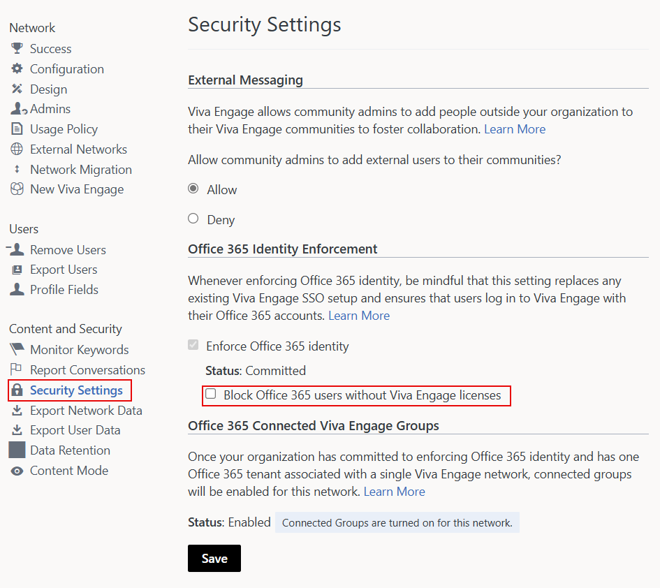
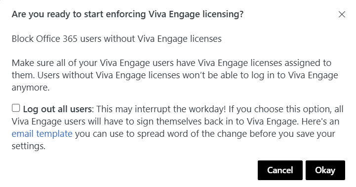

# Manage Viva Engage Core user licenses in Microsoft 365

When you assign user licenses as part of a bundled Microsoft 365 subscription plan, such as Microsoft 365 Enterprise, the user receives a Viva Engage Core license. You can remove or assign Viva Engage Core licenses for individual users in the Microsoft 365 admin center. You can also use Windows PowerShell cmdlets for Microsoft 365.
  
The Viva Engage Core service plan also enables access to Viva Engage. This functionality ensures uninterrupted Viva Engage experiences for your users. You can block users who don't have Viva Engage Core licenses from accessing Viva Engage by turning on the security setting **Block Microsoft 365 users without Viva Engage licenses**. See [Start blocking users who don't have Viva Engage licenses](manage-engage-licenses-microsoft-365.md#StartBlocking) in this article.
  
Users who have a Viva Engage Core license can access the Viva Engage in Teams application, if it's installed through the Teams admin center. Learn more about [installing Viva Engage](/viva/engage/setup).

:::image type="content" source="../media/engage-assign-licenses-users.png" alt-text="Screen shots show the assign licenses section of the Microsoft 365 admin center with Viva Engage Enterprise license available to assign.":::

>[!NOTE]
>All tasks related to assigning and managing Viva Engage user licenses require Microsoft 365 Global Administrator permissions.
  
## Manage licenses in the Microsoft 365 admin center

Assign and remove the Viva Engage Core license for users the same way you assign any other Microsoft 365 Enterprise license:
  
- Sign in to Microsoft 365 Enterprise, and go to the Microsoft 365 admin center. On the **Users** \> **Active Users** page, assign or remove the Viva Engage Core license.

For more information, see [Delete a user from your organization](/microsoft-365/admin/add-users/delete-a-user).
  
## Manage licenses through Windows PowerShell

You can use cmdlets in Windows PowerShell to assign Microsoft 365 licenses. With Windows PowerShell, you can easily see who has a license and assign licenses for multiple users at the same time. For more information, see [Assign Microsoft 365 licenses to user accounts with PowerShell](/microsoft-365/enterprise/assign-licenses-to-user-accounts-with-microsoft-365-powershell). You can also bulk-update licenses using a CSV file. For more information, see [How to bulk assign licenses to Microsoft 365 users based on CSV](/samples/browse/?redirectedfrom=TechNet-Gallery).
  
Use the following example Windows PowerShell script snippets to develop a complete script to manage licenses for your organization.

- The following example unassigns the Viva Engage Core license from the *litwareinc:ENTERPRISEPACK* (Microsoft 365 Enterprise) to the user *belindan\@litwareinc\.com*.

  ```powershell
  $UPN = "belindan@litwareinc.com"
  $LicenseDetails = (Get-MsolUser -UserPrincipalName $UPN).Licenses
  ForEach ($License in $LicenseDetails) {
    $DisabledOptions = @()
    $License.ServiceStatus | ForEach {
       If ($_.ProvisioningStatus -eq "Disabled" -or  $_.ServicePlan.ServiceName -like "*VIVAENGAGE_CORE*") { $DisabledOptions += "$($_.ServicePlan.ServiceName)" } 
    }
    $LicenseOptions = New-MsolLicenseOptions -AccountSkuId $License.AccountSkuId -DisabledPlans $DisabledOptions
     Set-MsolUserLicense -UserPrincipalName $UPN -LicenseOptions $LicenseOptions
  }
  
  ```

- To enable Viva Engage Core for a user without affecting anything else in their license, you can run the previous script but change

  ```powershell
  If ($_.ProvisioningStatus -eq "Disabled" -or $_.ServicePlan.ServiceName -like "*VIVAENGAGE_CORE*") { $DisabledOptions += "$($_.ServicePlan.ServiceName)" }
  ```

    to

  ```powershell
  If ($_.ProvisioningStatus -eq "Disabled" -and $_.ServicePlan.ServiceName -notlike "*VIVAENGAGE_CORE*") { $DisabledOptions += "$($_.ServicePlan.ServiceName)" }
  ```

- The following example returns information about any users who aren't currently licensed for Microsoft 365.

  ```powershell
  Get-MsolUser -All -UnlicensedUsersOnly
  ```

<a name="StartBlocking"> </a>

## Block users who don't have Viva Engage Core licenses

>[!NOTE]
>Taking this action can accidentally disrupt users' access to Viva Engage.

The Viva Engage Core license provides access to core Viva Engage services. When you need to block a user or an entire department from accessing Viva Engage, you first need to remove their Viva Engage Core license. Some users might not possess this license; you'll need to remediate those users before taking the step to block access to Viva Engage.

To do so, you'll need to take a few preparatory steps. Do the following to make sure your Viva Engage users can continue working smoothly:
  
- **Enable Microsoft 365 identity enforcement for Viva Engage users.** You can assign or unassign Viva Engage licenses only to Viva Engage users who are managed in Microsoft 365. To block Microsoft 365 users without Viva Engage Core licenses, *you must manage all Viva Engage users in Microsoft 365*. You can enable the **Block Microsoft 365 users without Viva Engage licenses** setting only when the [Enforce Office 365 identity for Viva Engage users](/viva/engage/configure-your-viva-engage-network/enforce-office-365-identity) setting is turned on.

- **Enable the Viva Engage Core license for all current Viva Engage users.** When you start blocking Microsoft 365 users without Viva Engage core licenses, those users can't access Viva Engage. Before you begin, make sure that all our current Viva Engage users have Viva Engage Core licenses. To check, go to the **Export Users** page in Viva Engage and export all users. Then compare that list to the list of users in Microsoft 365, and make any necessary changes. For more information, see [How to audit Viva Engage users in networks connected to Microsoft 365](/viva/engage/manage-viva-engage-users/audit-users-connected-to-office-365).

- **Tell your users about this change.** Let your users know that you're starting to block Microsoft 365 users that don't have Viva Engage Core licenses. The blocking action can disrupt their day-to-day usage of Viva Engage.

Use the following steps to block users who don't have Viva Engage Core licenses.

>[!NOTE]
>To ensure all Viva Engage service users log in with Microsoft 365 identities, and have the Viva Engage Core license, you can automatically log out all current users. Perform this step at a time of minimal user activity, because users can be logged out in the middle of their work. Always communicate to users ahead of time.

1. In Viva Engage, go to **Edit network admin settings**, and choose **Security Settings**.

2. On the Security Settings page, select **Office 365 Identity Enforcement**, and elect the **Block Office 365 users without Viva Engage licenses** checkbox. Confirm the selection. Microsoft 365 identity enforcement is a prerequisite for blocking users without Viva Engage licenses.

    

3. Select the **Block Office 365 users without Viva Engage licenses** checkbox, and then choose **Save**.
  
4. A message appears that asks if you're ready to start blocking Office 365 users without Viva Engage Core licenses.

    
  
    The confirmation message also offers a link to an email template so you can quickly send a notification to your network users. Make sure all current Viva Engage users have Viva Engage Core licenses. For more information, see [How to audit Viva Engage users in networks connected to Office 365](/viva/engage/manage-viva-engage-users/audit-users-connected-to-office-365).

5. To start blocking Microsoft 365 users without Viva Engage Core licenses, select **Okay** to confirm your choice. This step returns you to the **Security Settings** page, where the **Block Office 365 users without Viva Engage licenses** checkbox is now selected.

6. Choose **Save** to save all your settings on the page.

    If you leave the page without selecting **Save**, your settings don't take effect.

>[!NOTE]
>Always ensure that network users sign in with their full Microsoft 365 identity.

## Viva Engage content in Workplace Search and Copilot 365

Users without Viva Engage user licenses can see search results from Viva Engage, including results from Workplace Search and from Copilot 365. Without correct licensing, users can't select or otherwise interact with Viva Engage post links, or access Engage in any fashion.

Viva Engage content that appears in Workplace Search and in Copilot 365 is currently limited to Question posts from public communities, [Engage's Answers feature](eac-answers-overview-set-up.md), and [Storylines](eac-storyline.md). Users without Answers licenses can view Question posts, but can't interact with them, or post new questions.

## FAQ

**Q: Why are Viva Engage Core licenses "per user"?**

Per-user licenses let you assign Viva Engage to a subset of users in your company, typically for a geographical or team-by-team rollout. Only users who have a Viva Engage Core license can see the Viva Engage tile in the Microsoft 365 Copilot and the Viva Engage application in Teams.
  
**Q: What if I don't want anyone in my company to use a legacy Yammer identity?**

You can [Enforce Office 365 identity](/viva/engage/configure-your-viva-engage-network/enforce-office-365-identity) for your legacy Yammer users. They must each have a Viva Engage Core license to continue using Viva Engage.
  
**Q: How can I tell if all of my Viva Engage users have accounts in Microsoft 365?**

[Export your list of users](/viva/engage/eac-as-manage-data) from Viva Engage, and then check for users who aren't in Microsoft 365. For more information, see [Audit Viva Engage users in networks connected to Microsoft 365](/viva/engage/manage-viva-engage-users/audit-users-connected-to-office-365).
