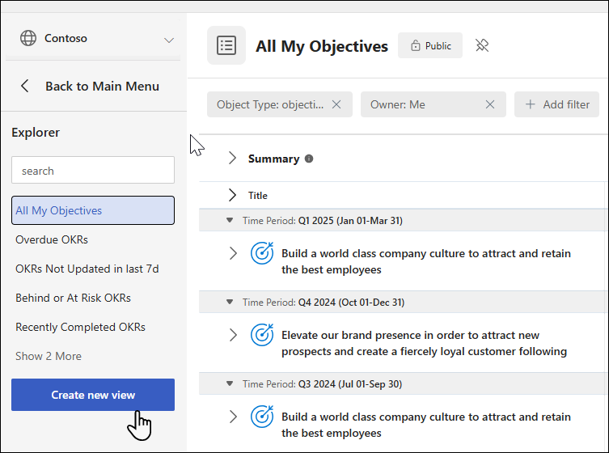
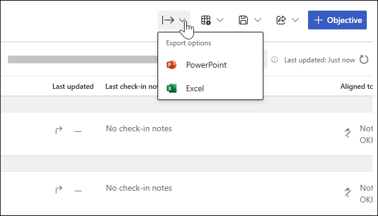
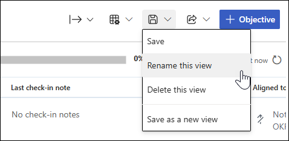
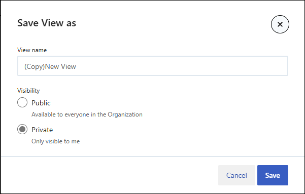

# Explorer

Explorer can generate preset views and create custom views. Use Explorer to filter out objectives and key results (OKRs) and initiatives of interest. Save commonly viewed filters to quickly access them again in the future.

## Default views in Explorer

The Explorer default views provide a strategic glimpse into your organization's OKRs and initiatives and their progress. You can choose from one of these handy preset views:

| View  | What it shows |
|---------|---------|
| All objectives | All company objectives in one place |
| All my objectives | All your objectives in one place |
| Overdue OKRs | OKRs that are past their due date. They need not be at risk or behind to be past their due date. |
| Not updated in the last seven days | OKRs that haven't had a check-in for the last seven days or longer |
| OKRs that haven't had a check-in for the last seven days or longer. | OKRs marked with status **at risk** or **behind** |
| Recently completed OKRs | OKRs that have been closed within the last seven days |
| Unaligned OKRs | OKRs that aren't aligned to a parent objective |

## Create custom views in Explorer

Viva Goals lets you create custom views and save the filters you use often.

1. To get started, select **Explorer** from the side navigation bar and then select **Create a new view**.

2. Select **add filter** to customize the view.

The following filters are available:

| Filters | Filters by |
|---------|---------|
| Aligned | Aligned to any or a specific objective. This filter can also identify unaligned objectives. |
| Check-in Date | Check-in date of the OKR/initiative. Filters by the exact check-in date, after or before a specific date, or more or less than *x* number of days. |
| Created Date | Created-on date of the OKR/initiatives. Filters by the exact created date, after or before a specific date, or more or less than *x* number of days. |
| Due | Due date of the OKR/initiatives. Find overdue OKRs/initiatives or view all OKRs/initiatives due within a particular time. Filters by overdue, after or before a specific date, or more or less than *x* number of days. |
| Integration | The integration connected with the OKR/initiative. |
| Keyword | Keywords in the OKR/initiative title. Filter based on the product name, campaign name, or other keywords unique to your organization. |
| Last Updated | Last time the OKR/initiative received an update. Find OKRs/initiatives that are falling behind on check-ins, or get a snapshot of activity during a specific timeframe. |
| Time period | The time period the OKR/initiative belongs to. |
| Manager | Manager of the OKR/initiative owner. |
| Object type | Filters by objective or key result or initiative. |
| Owner | Owner of the OKR/initiative. This filter can also locate unassigned OKRs/initiatives. |
| Progress | Percentage of completion. This filter is handy in combination with the due date filter. |
| Start date | The start date of the OKR/initiative. |
| Status | The objective/initiative's current status. Select from Not Started, On Track, Behind, At Risk, Closed, Postponed, or Reopened. |
| Tag |  Search by tags added to OKRs/initiatives. |
| Team type | The team type of the OKR/initiative. Team type is specified when you create a team in the admin dashboard. |
| Time period | The time period the OKR/initiative belongs to. |
| Type | Organization-level, team-level, or individual-level OKR/initiatives |

Filters are best when used in combination. To create meaningful and relevant views, combine several filters.

By default, views list objectives, key results, and initiatives. To view only top-level objectives, select the checkbox in the upper-right corner.

## Save and export

Save and export views for future reference or to share insight with your team. To save a view, select the **Save** button in the upper-right corner. You'll be prompted to name the view and select a sharing option.

> [!Note]
> If you don't want to share the new view with your team, change the security setting to **Only Me** and then save the view.

You should now be able to find the saved view in Explorer. If you made it available to everyone, they'll be able to find it there also.

If you want to export the view, go to **Export Options** in the upper-right corner. You can choose to export to Excel or PowerPoint.

### Export to Excel

If you choose Excel, the exported file will be emailed to your account.

- Select the format of the export file, CSV or XLSX.

- Select the fields to include in the export file.

- Include key results/initiatives along with the objectives exported. In this case, first level key results/children will be exported along with each objective.

- Choose to export tags in separate columns in the file.

Any changes that you make will be preserved for every user for subsequent exports.

### Export to PowerPoint

If you choose PowerPoint, the exported file will be automatically downloaded to your system.

- Select template from **View Options**.

- Select the **Date as on** option as required.

When you select **Export**, the file will automatically download.

## Rename a view

You can rename a view after it's been saved: Select **Save options** then **Rename this View**.

## Use an existing view to create a similar view

Viva Goals enables you to edit a saved view and save it as a new view. To do this, open a saved view, make any appropriate changes to filters, and then select **Save** from the dropdown on the right side. You'll be prompted to update the current view or save it as a new view.

## Sort your OKRs in Explorer

You can sort your objectives and key results in Explorer.

Select the **View Options** dropdown and select **Sort by**.

This information refers to the order in which the OKRs are arranged in the Entity (organization/team/individual) OKR view. For example: If you have OKRs arranged in a certain manner on your page and want to see the same priority order in Explorer, you can use this option.  

## Frequently asked questions 

1. **How do I view all OKRs in Explorer?**
    1. In Explorer, select the **All Objectives** preset view.
        :::image type="content" source="../media/goals/4/46/g.jpg" alt-text="Screenshot shows the Explorer All Objectives view." lightbox="../media/goals/4/46/g.jpg":::

1. **How do I view all initiatives?**
    1. In Explorer, apply the filter for **Object Type** as **initiative** to view all initiatives.
        :::image type="content" source="../media/goals/4/46/h.jpg" alt-text="Screenshot shows how to choose to filter for all initiatives." lightbox="../media/goals/4/46/h.jpg":::

1. **How do I export my data?**
    1. Use filters to access the data you want, and then go to **Export Options**. You'll receive an email with a link to download your OKRs and initiatives. Remember to clear the **Show only top-level objectives** checkbox if you need the KRs too.
         :::image type="content" source="../media/goals/4/46/i.jpg" alt-text="Screenshot shows how to choose to export data." lightbox="../media/goals/4/46/i.jpg":::

1. **How do I save a view?**
    1. To save a view for easy access, select **Save view** in the upper-right corner. Enter a name for the new view and select a visibility option. After it's saved, you can access the view from the Explorer menu.
        :::image type="content" source="../media/goals/4/46/j.jpg" alt-text="Screenshot shows how to save a view." lightbox="../media/goals/4/46/j.jpg":::

1. **How do I delete a view?**
    1. To delete a saved view go to **Save Options -> Delete this view**.

1. **Who can access my view?**
    1. That depends on the availability configuration you choose when you save the view. There are two options:
        - Private: Only you can access the view.
        - Public: Everyone in the organization can access the view.

    To change this setting, select **Save view**, change the setting, and save it again.
    

1. **What does exporting tags as a separate field mean?**
    1. If an objective, key result, or initiative has more than one tag, the field can be exported as separate columns instead of comma-separated values in the .csv/Excel file.

1. **How do I export my OKRs and initiatives?**
    1. You can use Explorer to export OKRs and initiatives. Go to Explorer from the main menu. You can use the **All objectives** view if you want to export all your OKRs or apply any desired filters, like time period or owner.

> [!NOTE]
> By default, Explorer only displays top-level objectives. If you want to include the KRs/initiatives, you can use the flat-list view or choose to include the child key results/child initiatives when you export.

1. **Flat-list view:**
    1. After you modify your view as desired, go to **Export options** to export it. You'll soon receive an email with your download. To learn more, see our [Explorer article](https://help.ally.io/en/articles/5845706-explorer).

1. **How do I filter OKRs by team in Explorer?**
    1. Use the **Type** filter to refine the OKRs list by teams or individuals.
    Apply the changes and save the view for future reference.

