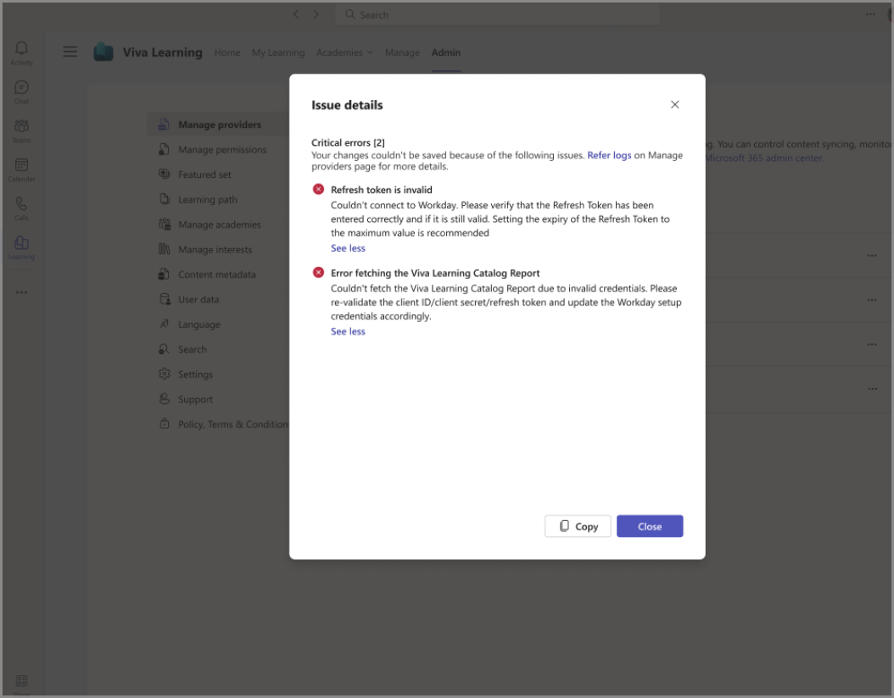

# Content provider setup and sync issues

If you encounter any failures in your provider setup or during a daily sync, you can view the error details by going to your provider view and selecting **View Details**.

You then see the issue details window, which includes error description and steps needed to address the issues. You must fix all errors to ensure a successful synchronization. Warnings don't block synchronization, but still need attention. User experience varies based on the provider. 

